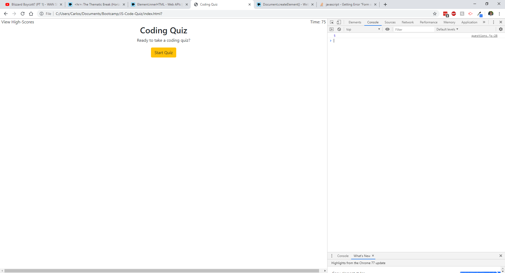

# JS-Code-Quiz

## Purpose: 
This quiz is to test the your knowledge on some javascript codes. It is timed and your score is related to the time. Getting a question wrong will decrease the timer by 15 seconds. The test will consist of five questions. Once the test is concluded, it will ask for initials so you may save your score to your local storage. It will also display the timer in the top right. You may also view other high score in the top left.

### Commit History:

1st Commit: Base quiz. Only have two questions and the the questions continue to the next once a valid button is clicked.

2nd Commit: Got all the buttons working. Added more questions. Records the highest score. Tried innerHTML to create elements to later get but didn't work. I created individual elements and that did work. This assign is basically complete. 

Could improve aesthetics. Ran out of time.

#### End

https://carlos-rojas-ca.github.io/JS-Code-Quiz/index.html

